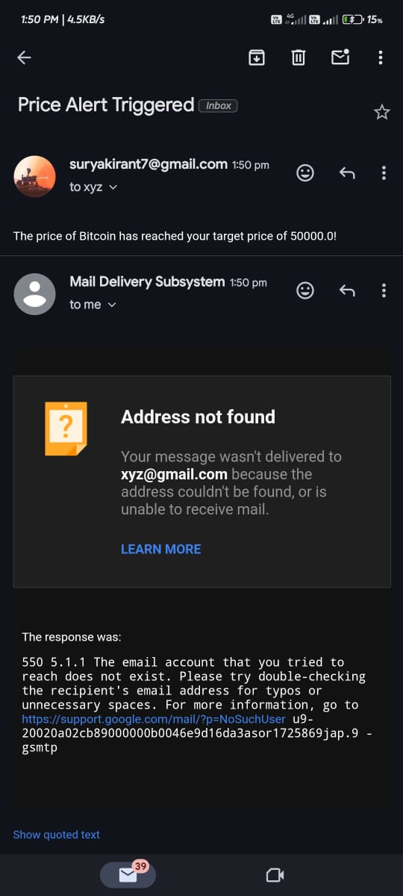

# Tanxfi Task

## Description
This project is a Django application for managing price alerts for cryptocurrencies.

## How to Run
1. **Install Docker:**
    - Ensure you have Docker installed on your machine. Follow the instructions based on your operating system:
        - [Install Docker on Windows](https://docs.docker.com/desktop/install/windows-install/)
        - [Install Docker on macOS](https://docs.docker.com/desktop/install/mac-install/)
        - [Install Docker on Linux](https://docs.docker.com/desktop/install/linux-install/)

2. **Clone this repository:**
    ```bash
    git clone https://github.com/Suryakiran09/tanxfi_task.git
    ```

## Open tanxfi_task main_folder

  - Go to the project folder using

        cd tanxfi_task

  - To check whether you are in correct path or not
    type tree in the cmd
    ```bash
    C:.
    ├───btc
    │   ├───migrations
    │   │   └───__pycache__
    │   └───__pycache__
    └───tanxfi_task
        └───__pycache__
    ```

      It should be like this

## Setup
Follow these steps to set up and run the project:(You can run this project in three ways)

You can Choose any one of this

- ## 1. Using Docker

  - Open Docker Desktop
 
  - In Terminal within the same path type the below commands

  - Create the Docker Image

    ```bash
    docker build -t tanxfi_app .
    ```
  
  - Run the Docker Image

    ```bash
    docker run -p 8000:8000 tanxfi_app
    ```


- ## 2.Install the honcho library using this command (Using a Python Package)

      
      pip install honcho
      

    - Run this command to start the django api and background tasks

      ```bash
      honcho start
      ```
     
    If that doesn't work


- ## 3.open the project file in the terminal and run these commands (Running manually)


    - *pip install -r requirements.txt*

    - *python manage.py makemigrations*

    - *python manage.py migrate*

    - *python manage.py runserver*

    - Run these commands in different terminals from now

    - *celery -A tanxfi_task beat -l info*

    - *celery -A tanxfi_task worker -l info*


# END-POINTS

  - 1. Use this if you are using Docker ---**Docker**---

       url : http://localhost:8000/alerts/create/


      - http://localhost:8000/alerts/create/ - For creating the alerts here you can add the crypto_currency and target_price

      - http://localhost:8000/alerts/delete/{id}/ - We can delete the alerts that are created before

      - http://localhost:8000/alerts/list/ - We can access all the alerts that are created before

      - http://localhost:8000/token/ - Here we can create the JWT token to access the API

        and also there is no user creation functionality in this code a django super user has been created 

        with user name surya and password 001

        using this you can create the access token and refresh token

      - http://localhost:8000/token/refresh/ - Here using the refresh token we had before we can get the new access token


--------
--------
--------

  - 2. This will start the Django development server and the background tasks worker(Redis, Celery). -----**Honcho and Manual**-----
  
       to stop this just press ctrl+c
  
       you can access the api's in the web browser using this url
  
       url : http://127.0.0.1:8000/alerts/create/


      - http://127.0.0.1:8000/alerts/create/ - For creating the alerts here you can add the crypto_currency and target_price

      - http://127.0.0.1:8000/alerts/delete/{id}/ - We can delete the alerts that are created before

      - http://127.0.0.1:8000/alerts/list/ - We can access all the alerts that are created before

      - http://127.0.0.1:8000/token/ - Here we can create the JWT token to access the API

        and also there is no user creation functionality in this code a django super user has been created 

        with user name surya and password 001

        using this you can create the access token and refresh token

      - http://127.0.0.1:8000/token/refresh/ - Here using the refresh token we had before we can get the new access token


## Project overview

In this application I used django rest frame work to build a api which continously checks the bitcoin price and also this api allows the users to create, delete and see the list of all the alerts they have created. I used inbuilt sqlite database for this api and used the api which was provided in the task details file and used it to monitor the bitcoin price and created the functionality which sends email to the user when the alert has been triggered. Here I used celery and redis which I used for the background tasks. I have used the Docker and honcho for running all the tasks at once.

To test the api start the api and run the commands in testing.ipynb


##Alert success mail



